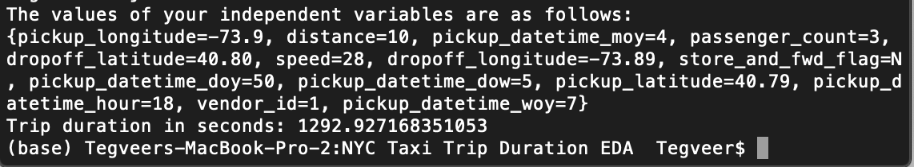

# In-depth EDA of the NYC Taxi Trip Duration dataset

The primary dataset is one released by the NYC Taxi and Limousine Commission, which includes pickup time, geo-coordinates, number of passengers, and several other variables. The dataset I have used contains 729322 observations, almost a half of the total observations present in the Kaggle Competition dataset

The EDA performed is explained in much detail and with support from various sources collected about NYC traffic as well as taxi rules and regulations. Also, note that this dataset is from 2016 and, since then, traffic rules may have been updated. Therefore, keeping the time frame in mind, I conducted my EDA in the most suitable manner to give truthful insights and, eventually, to create a fair model.

Gaining insights from maps always intrigues me and, hence, I used the first 1000 shuffled observations for plotting and visualizing pickup as well as dropoff points on the NYC map. Folium is our best friend for map-plotting from geospatial data, latitude and longitude degrees in our case. Green markers with a label of the play icon denote pick up locations and red markers with a label of the stop icon denote dropoff locations.

For model building, I wanted to play around with the lauded H2O AutoML workflow. After cleaning the data and splitting it to a 90-10 train-test split, I put H2O at work. I purposely excluded the "Stacked Ensemble" to, firstly, expedite the training process and, secondly, to obtain individual error figures for the other supervised ML algorithms H2O employs, including Gradient Boosting Machine, XGBoost, Distributed Random Forest, and Generalized Linear Model. The best method with lowest RMSE (Root Mean Squared Error) out of the other 9 methods was the fourth model of the Gradient Boosting Machine method. H2O also helps us understand the most important variables that contibuted in model explanation and, in our case, it was distance, speed, pickup longitude, and dropoff longitude in descending order.

To run the project, simply clone the repository and then open a new window in your terminal. Upon opening the terminal, set the current directory to the cloned folder's path and then enter the following two commands:

```bash
javac -cp h2o-genmodel.jar -J-Xms2g -J-XX:MaxPermSize=128m main.java
```
```bash
java -cp .:h2o-genmodel.jar main
```

The final output shall look like this:



Feel free to modify the main.java file by playing around with different values of the independent variables!

Sources:

https://www.kaggle.com/nitin194/nyc-taxi-trip-duration-prediction/notebook 

https://medium.com/analytics-vidhya/exploratory-data-analysis-of-nyc-taxi-trip-duration-dataset-using-python-257fdef2749e 

https://www.google.com/maps 

https://www.tripadvisor.in/ShowTopic-g60763-i5-k6194060-Taxis_from_times_square_to_new_jersey-New_York_City_New_York.html 

https://wazeopedia.waze.com/wiki/USA/New_York/Speed_limits 

https://www1.nyc.gov/assets/tlc/downloads/pdf/driver_education_study_guide.pdf (very important resource with concern to our project. This document specifies speed limits in NYC and on NYC highways, useful to detect outliers in our dataset. It also delineates major streets and highways of all boroughs, which gives the reader an intuitive overview of pick up and drop off locations visualized in our project.) 

https://www1.nyc.gov/site/tlc/passengers/passenger-frequently-asked-questions.page 
We shall shuffle our dataset first and then use the first 1000 observations for the convenience of plotting and visualization. Note that the green markers with a label of the play icon denote pick up locations and red markers with a label of the stop icon denote dropoff locations.

https://docs.h2o.ai/h2o/latest-stable/h2o-docs/mojo-quickstart.html
